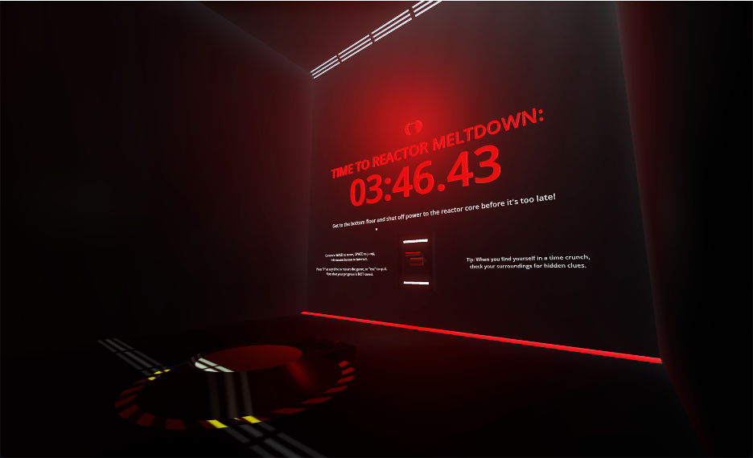

# CORE Meltdown

Author: Christian Caamano

Email: christian.d.caamano@vanderbilt.edu

VUNetID: caamancd

Class: CS 3981 - Game Engine Design

Instructor: Bobby Bodenheimer

#### Link to gameplay video: https://youtu.be/s8OxcYGYbXU

Game Name: CORE Meltdown

Characteristics: 3D, first person, puzzle, 5 levels

Description: The reactor core of a nuclear power plant is experiencing critical failure and is about to melt down. Get to the bottom floor and shut down power to the facility before meltdown strikes! You have 4 minutes and 10 seconds to prevent disaster. On each of 4 floors, you must solve a unique lever puzzle to open the hatch that lets you access the floor below. On the 5th and final floor, you must solve a final puzzle to unlock the main power lever that shuts down the facility. When you pull this final lever, you beat the game! Can you make it in time?

## Functionality and Features

#### 1. Basic game features

Press "R" to restart the game from scratch, or "ESC" to quit.

A large timer is visible on every floor. At each second of the timer, a tick sound effect plays. At each minute mark, an ominous sound effect plays. When the game is beaten, the timer stops, a chime plays, and the player is informed that the reactor core is now stable. When time runs out, the player loses and hears an ominous tone.

There is 1 text-based hint hidden on level 3, and 2 hints hidden on level 4.

#### 2. Player controller

Use the WASD keys to move around, spacebar to jump. Move the mouse to look around in first person.

#### 3. Interactable objects

Interact with certain objects (levers, keypad) by clicking the left mouse button.
Interactable objects may at times be 'locked' from interaction, meaning interaction is currently prohibited. If this is the case, nothing will happen when you attempt interaction, and you will only hear a minimal two-tone beap sound effect.

#### 4. Levers

Levers are interactable. When unlocked, you can interact with them to toggle them down or up. When toggled down, they become activated; when toggled up, they become deactivated. When toggled, a short sound effect plays and an animation shows the lever moving up/down.

#### 5. Keypad

On floor 5, there is a keypad with 4 single-digit number displays, as well as corresponding up/down buttons underneath each display. The buttons are interactable, and they can be used to cycle each number between 0-8. The overall 4-digit sequence is treated as a passcode; once the correct sequence is input, a sound effect chime plays, the keypad buttons are locked, and the lever beside the keypad unlocks.

#### 6. Hatches

On floors 1-4, there is a hatch on the ground. When the puzzle for that floor is beaten, the hatch opens, allowing the player to access the next floor. An animation and sound effects correspond to the hatch opening.

#### 7. Puzzles

Floor 1: activate the lever to open the hatch.
Floor 2: activate all levers to open the hatch.
Floor 3: activate the rightmost lever and deactivate all others to open the hatch.
Floor 4: activate levers 2, 4, 6, and 8 to open the hatch.
Floor 5: input the sequence 2468 into the keypad to unlock the lever; activate the lever to 'shut down power' and beat the game.

#### 8. Strobe light (GDExtension feature)

On each floor, a red alarm light on the front wall slowly fades in and out. This was implemented as a GDExtension in 'src/strobelight.h' and 'src/strobelight.cpp'.

#### 9. Sound effects (extra credit feature)

See points 1 and 3-6 above for descriptions of the sound effects used in this game.

## Compilation Instructions

Compilation instructions are for MacOS devices.

Go to the following link to download the Mac executable (the file is too large to be stored on GitHub): [CORE_Meltdown.dmg](https://www.dropbox.com/scl/fi/ryof4tmkqzv22xacqpk5w/CORE_Meltdown.dmg?rlkey=2dm7rqly9pdowd7ypvcfy31qt&st=skkhmw5i&dl=0)

Go to your downloads folder on your computer and double click the file to open. Now double-click the Godot icon named 'CORE_Meltdown' and the game will run. If you see a notification by Mac's Gatekeeper preventing the game from running, attempt the following:
1. Close out of the security notification, then right click the Godot icon and select 'Open'. If this does not work, go to the next step.
2. Go to System Settings -> Privacy & Security -> Accessibility and toggle the slider 'on' next to the CORE Meltdown application. If you do not see it listed under Accessibility, it may be listed in a different section of Privacy & Security.
3. If none of this works, email 'christian.d.caamano@vanderbilt.edu' for help.

## Additional Documentation

See folder 'docs' for development screenshots.
